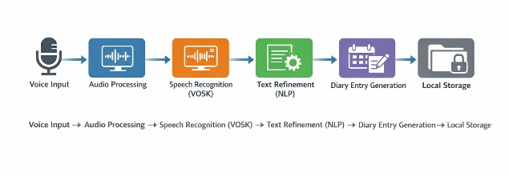
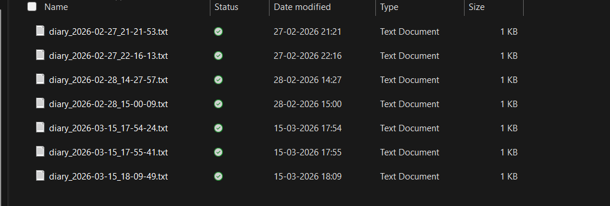
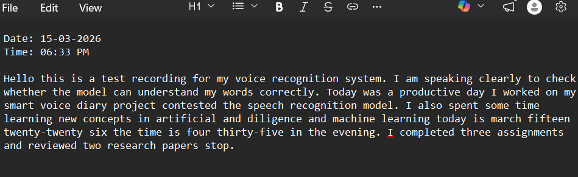

# 🎤 Smart Voice Diary

A voice-powered digital diary that converts spoken words into organized diary entries using Speech Recognition and Natural Language Processing (NLP).

---

## 📌 Overview

Smart Voice Diary enables users to record diary entries through voice commands instead of typing. The system converts speech into text, processes it using NLP techniques, stores the diary securely, and provides an interactive user experience.

This project aims to make personal journaling faster, more accessible, and hands-free.

---

## ✨ Features

- 🎙 Voice-to-Text Diary Entry
- 🧠 NLP-based Text Processing
- 😊 Sentiment Analysis
- 🔍 Search Previous Entries
- 💾 SQLite Database Storage
- 🔊 Text-to-Speech Playback
- 📅 Date and Time Stamping
- 📝 Edit/Delete Entries

---

## 🛠 Technologies Used

- Python
- Vosk Speech Recognition
- Natural Language Processing (NLTK)
- SQLite
- pyttsx3
- SpeechRecognition
- Tkinter (GUI)

---

## 📂 Project Architecture

Speech Input

↓

Speech Recognition (Vosk)

↓

Natural Language Processing

↓

Sentiment Analysis

↓

Database Storage (SQLite)

↓

Diary Management

↓

Voice/Text Output

---

## Installation

Clone the repository

```bash
git clone https://github.com/yourusername/Smart-Voice-Diary.git
```

Move into project folder

```bash
cd Smart-Voice-Diary
```

Install dependencies

```bash
pip install -r requirements.txt
```

Run the project

```bash
python src/main.py
```

---
## Screenshots

### Architecture



### Home



### Voice Recognition


### Output



## Future Improvements

- User Authentication
- Cloud Synchronization
- Mobile Application
- AI-based Diary Summaries
- Emotion Detection
- Voice Commands

---

## Project Outcome

Developed an intelligent diary system capable of converting speech into meaningful diary entries while utilizing NLP for enhanced user experience.

---

## Author

**Sathwika Kammampati**


